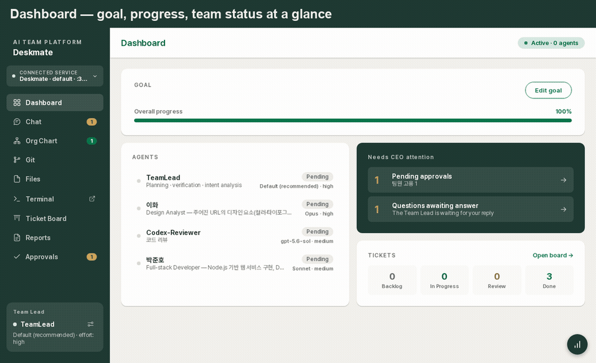

# Deskmate

**A web platform that runs Claude Code as a company-like AI team.**
You are the CEO, a Team Lead agent plans & verifies, Worker agents implement. Chat your instructions; results come back as verified reports and deliverables.

> 한국어 버전: [README.md](README.md)



## What is this for?

Instead of driving Claude Code 1:1 in a terminal, Deskmate lets you **operate multiple agents as an organization**:

- Split development, docs and design work across **role-based AI members**, with a Team Lead writing briefs and verifying results
- Track progress with a **ticket board, requests (REQ) and reports**; approve important decisions through an **approval inbox**
- Review web deliverables by **pinning comments directly on the page**; structured change orders go back to the team
- Manage files, a terminal and Git on the server from any browser (mobile included)

In one sentence: **a tool that builds a company on top of Claude Code.**

## Requirements

| Item | Details |
|---|---|
| **Node.js** | ≥ 22.5 (uses the built-in SQLite; older versions exit with a friendly message) |
| **Claude Code** | **installed + authenticated** on the server (`claude /login` or `claude setup-token`) — required; without it you only get the mock UI preview |
| **Claude plan** | Pro/Max subscription (recommended) or an Anthropic API key |
| Optional | `git` (Git menu), `codex` CLI (external AI members), `tmux` (persistent terminal sessions) |

## Quick start

Requirements: **Node.js ≥ 22.5** (older versions exit with a friendly message), a Claude Pro/Max subscription (recommended) or an Anthropic API key.
Optional dependencies: `git` (Git menu; absent = that menu is disabled), `codex` CLI (external AI members).

```bash
# Run straight from GitHub (no build step)
npx github:asete93/deskmate

# Options
npx github:asete93/deskmate \
  --port auto \                     # auto-pick a free port (printed in the banner)
  --name myproject \                # separate data space (~/.claude-control/myproject)
  --allow 192.168.0.0/16 \          # allowed IP ranges (all allowed if omitted)
  --https \                         # self-signed HTTPS (clipboard & secure-context features)
  --http-port 3201 \                # listen on HTTP alongside HTTPS (default: HTTPS port + 1, off = disable)
  --lang en \                       # system language at boot (UI + agent language)
  --no-terminal --no-files \        # hard-disable terminal/files (hidden even in Settings)
  --driver sdk                      # mock | sdk | auto
```

Authentication (to drive real Claude) — one of:

```bash
# 1) Recommended: long-lived subscription token
claude setup-token
CLAUDE_CODE_OAUTH_TOKEN=<token> npx github:asete93/deskmate

# 2) A machine already logged in via `claude /login` just works (auto-detected)

# 3) API key
ANTHROPIC_API_KEY=sk-ant-... npx github:asete93/deskmate
```

Without credentials it boots with the **mock driver** (full-flow simulation) so you can preview the UI.

Updating: if a new commit doesn't show up, `rm -rf ~/.npm/_npx` and rerun, or `npm i -g github:asete93/deskmate`. Your data lives outside the package (`~/.claude-control/`) and survives updates.

## Learn more

| Doc | Contents |
|---|---|
| [Details](docs/DETAILS.en.md) | Security · macOS/Linux auth · token cost · methodology · core concepts · full features · screenshots · data & architecture |
| [User guide](docs/USER_GUIDE.en.md) | Screen-by-screen usage (start–chat–org–tracking–deploy–troubleshooting) |
| Mobile app | iOS/Android app (connects to the same server) — separate repo, distributed via TestFlight |

> ⚠ **Security in one line** — dashboard access = shell access on your server. Never expose it to the open internet; use a LAN/VPN. See [Details](docs/DETAILS.en.md).

## License

[MIT](LICENSE) — free to use, modify, redistribute and commercialize, as long as the copyright notice is kept. Provided "as is", without warranty.
