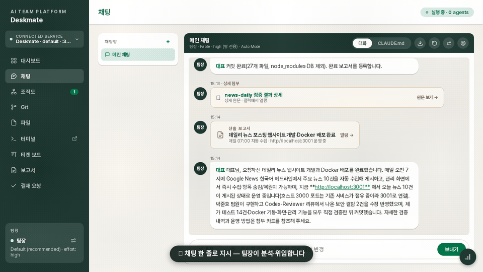
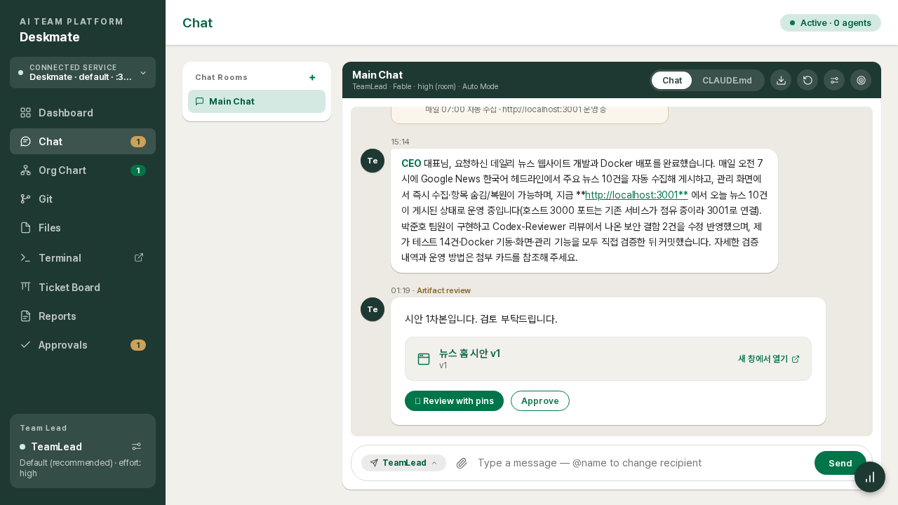
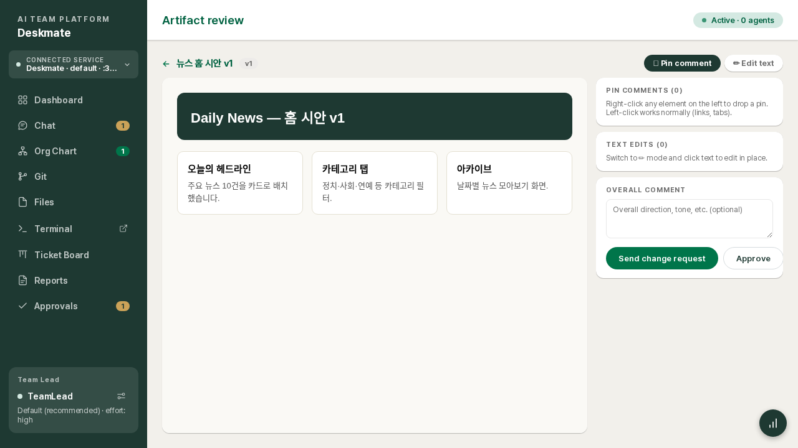
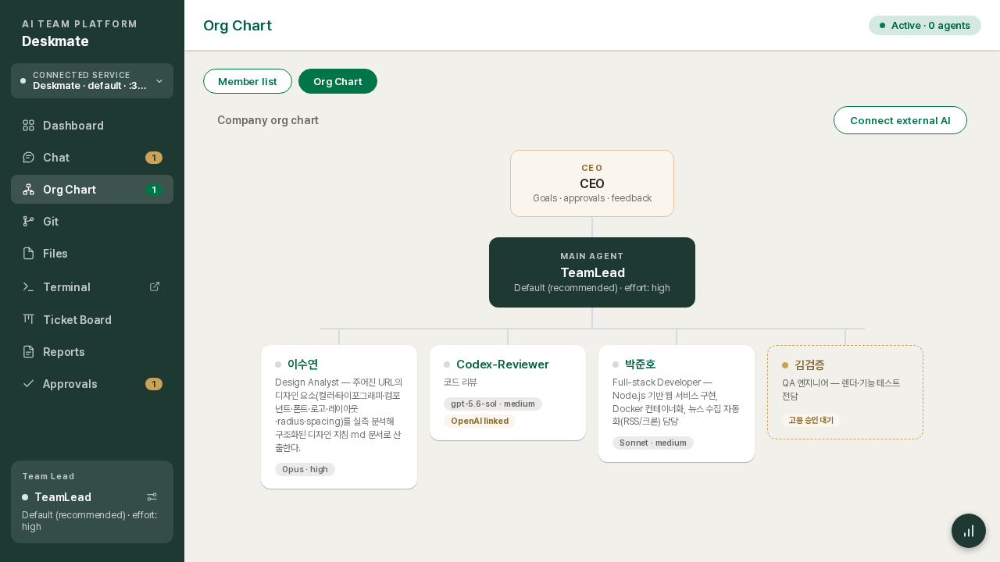
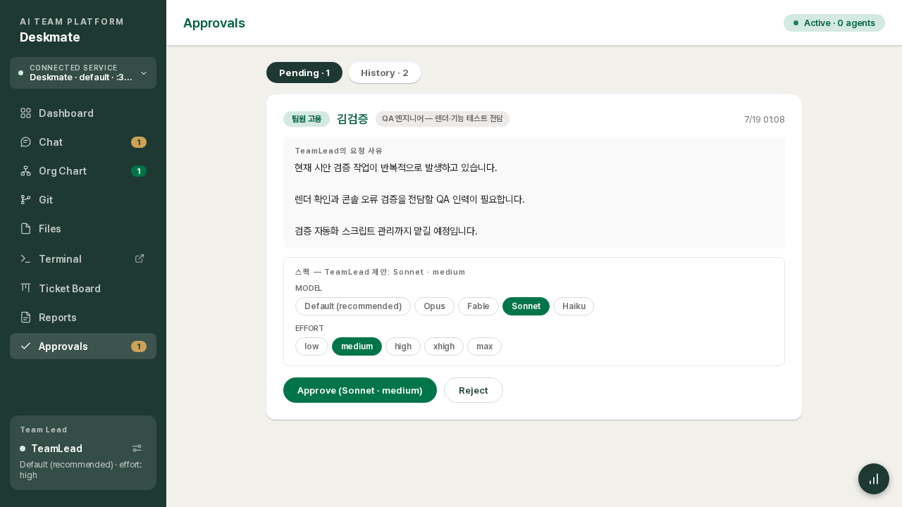

[한국어](README.md) · **English**

# Deskmate

**A web platform that runs Claude Code like a company.**
CEO (you) → Team Lead (main agent) → Members (worker agents). Send one chat message and the Team Lead analyzes, decomposes and delegates; members implement; results come back verified, as reports and artifacts.



## Requirements

| Item | Details |
|---|---|
| **Node.js** | ≥ 22.5 (uses the built-in SQLite; older versions exit with a friendly message) |
| **Claude Code** | **installed + authenticated** on the server (`claude /login` or `claude setup-token`) — required; without it you only get the mock UI preview |
| **Claude plan** | Pro/Max subscription (recommended) or an Anthropic API key |
| Optional | `git` (Git menu), `codex` CLI (external AI members), `tmux` (persistent terminal sessions) |

> **Security notice** — dashboard access equals command execution on your server. **Do not expose it to the open internet; use it inside a private network or a VPN (Tailscale/WireGuard).** If external access is unavoidable, combine login + `--allow` + HTTPS from the security section below.

## What is this for?

Instead of driving Claude Code 1:1 in a terminal, Deskmate lets you **operate multiple agents as an organization**:

- Split development, docs and design work across **role-based AI members**, with a Team Lead writing briefs and verifying results
- Track progress with a **ticket board, requests (REQ) and reports**; approve important decisions through an **approval inbox**
- Review web deliverables by **pinning comments directly on the page**; structured change orders go back to the team
- Manage files, a terminal and Git on the server from any browser (mobile included)

In one sentence: **a tool that builds a company on top of Claude Code.**

## ⚠ Security — read this first

**Anyone who can reach this dashboard can effectively run commands on your server.**
Agents, the web terminal and file editing all operate with server shell privileges. Never expose it without access control. Combine these:

| Control | How | Notes |
|---|---|---|
| **Login** | Settings → Login on | Single password (scrypt hash). 5 failures = 15-min lockout + global attempt cap. Protects API, files, WebSocket, terminal. **Mandatory on public networks** |
| **Password recovery** | `touch <data-dir>/reset-password` | The data dir is shown on Settings and in the startup banner (default `~/.claude-control/<name>`). Shell access = proof of ownership |
| **IP firewall** | `--allow 192.168.0.0/16,127.0.0.1/32` | Everything outside the CIDR gets 403. Strongly recommended with 0.0.0.0 binding |
| **HTTPS** | `--https` | Auto-generated self-signed cert; enables clipboard and other secure-context features |
| **Parallel HTTP** | `--http-port <n\|off>` | With `--https`, also listen on plain HTTP (default: HTTPS port + 1, `off` = HTTPS only). For clients that reject self-signed TLS (e.g. mobile app) |
| **Feature kill-switch** | `--no-terminal --no-files` | Fully disables the feature: hidden even from Settings, API and connections blocked |

Also: the workspace file API blocks path traversal (`../`); structural changes such as hiring members are refused by the server without CEO approval (enforced in server logic, not prompts). For direct internet exposure, use a TLS reverse proxy + login + `--allow` together.

## Will it use more tokens, or fewer?

Honestly: **orchestration itself costs extra tokens.** Deskmate ships the levers to claw that back.

**Where it spends more**
- Team Lead judgment turns — request triage, brief writing and result verification are each LLM turns
- Independent sessions per room/member — context cost scales with session count
- Auto commit messages (optional) — one Haiku call, only when you commit with an empty message

**Where it saves**
- **Per-room model/effort overrides** — casual rooms on Haiku/low, important rooms on top-tier models only
- **Per-member model tiers** — repetitive-work members on Haiku, only the design member on an Opus-class model
- **Memory reset** (all sessions or per room) — flush bloated context that inflates every turn
- **External AI members (Codex)** — offload reviews etc. to OpenAI, spreading Claude usage
- **Per-REQ token accounting + a live usage widget** — you always see where tokens go
- Long reports collapse into summary + popup; tickets are auto-created on delegation — fewer formatting turns

## Built-in methodology

- **Karpathy coding guidelines built in** — every agent's immutable constitution applies Andrej Karpathy's LLM-coding principles by default: *think before coding (no guessing) · simplicity first (no over-engineering) · surgical changes (only what was asked) · goal-driven execution (iterate until verified)*.
- **Advisor strategy** — the Team Lead is locked into an "advisor" position: judgment, briefs and verification only, with implementation delegated to members (its file-editing tools are blocked server-side). The platform enforces the cost structure of expensive models for judgment, cheaper models for labor.

## Core concepts

### CEO – Team Lead – Members

- **CEO (you)**: sets goals, gives instructions, approves, reviews deliverables. The only human.
- **Team Lead (main agent)**: analyzes → decomposes → delegates → verifies → reports. Its **file-editing tools are physically blocked** — it must delegate implementation.
- **Members (worker agents)**: take briefs, implement, verify, report to the Team Lead. Each has an independent session, role and custom instructions.

### The only three ways a member is created

1. **Team Lead proposal → CEO approval**: the Lead files an approval with reasoning, role and a **suggested model/effort**; you adjust the spec on the approval screen and approve.
2. **Direct hire by the CEO**: from the org chart, specify name/role/model/instructions — immediate (you are the approver).
3. **External AI**: attach OpenAI Codex as a member — still under the Team Lead's command.

Any other path (agents spawning hidden subagents, etc.) is blocked by the server. Dismissals also go through approval.

### Chat rooms — an independent brain per room

- Each room has its **own Team Lead session (memory)**. Topics don't bleed into each other.
- Decisions from other rooms are retrieved on demand via a **full-history search** tool.
- **Model/effort can be overridden per room** (chat ⚙ → THIS ROOM). Unset = the Lead's base spec.
- Two ways to clear: **full reset** (messages + memory) / **messages only** (screen cleanup; memory and in-flight work kept).

## Features

### Multi-server
Run one instance per project with `--name`, register several servers (other ports/machines) in the sidebar **service switcher**, and hop between them in one browser.

### Chat
Talk to everyone in one place (@name targeting, recipient pill), live delegation traffic, sender avatars (click → that member's settings), file/image attach (drag & paste), **large pastes collapse into a chip** (full text in a popup), Shift+Enter newline, interactive cards (choice / form / diff approval / artifact review), Plan Mode **plan-approval card**, conversation **Markdown export**, unread badges.

### Per-member model settings
Org chart (or chat avatar click) → settings popup: **name, avatar, role, custom instructions, model, effort** per member. Specs are also adjustable at hire-approval time. Combine with room overrides for patterns like "Opus in this room only".

### Usage monitoring
The widget (bottom tab on mobile) shows **Claude subscription usage** (session/weekly limits, reset times) and today's tokens in/out. Every REQ accumulates its own token count.

### Files
Workspace-scoped explorer + CodeMirror editor (syntax highlighting, ⌘S). DnD move/upload/download, multi-select (Ctrl/Shift/rubber-band) with **⌘C/⌘X/⌘V/Del**, context menu, clipboard-paste upload. Mobile: editor-first with a file-tree popup.

### Terminal
A web terminal into the server shell. Split panes, per-pane font size, DnD pane arrangement, copy/paste, scrollback, pop-out window. Sessions survive while the server runs; orphaned sessions are reaped after 30 minutes. **Off by default.**

### Git
Commit graph, branches, per-commit diffs, collapsible file tree — plus **staging → commit from the dashboard**: stage/unstage per file, diff preview, `.gitignore` editing (list refreshes on save), and **auto-generated commit messages** when you leave the message empty (one Haiku call; rule-based fallback costs zero tokens).

### Work tracking — tickets, requests, reports, approvals
Every delegation **auto-creates a ticket** (→ review on member reply → done when the REQ completes). CEO requests are grouped as REQs with their conversation, tokens and report. Completed work registers a **deliverable report** (web view + PPTX/Excel export, 4 visual themes). Directional decisions and risky work land in the **approval inbox**.

### Artifact pin review
**Right-click to pin** comments on a rendered deliverable (left-click keeps normal behavior); edit text in place. Submitting sends a structured change order (element selectors, before/after) to the team, and the revision comes back for another round. Wide pages auto-scale to fit.

### And more
- **Scheduled jobs**: daily/weekly/one-off automatic instructions to the Lead or a member
- **Bilingual**: Korean/English — switches the UI **and the agents' working language** (translation-role members are exempt)
- **Run modes**: Plan (execute after plan approval) / Auto (auto-accept file edits) / Ask
- **Mobile-optimized**: swipeable bottom tabs, full-screen layouts without page headers

## Quick start

Requirements: **Node.js ≥ 22.5** (older versions exit with a friendly message), a Claude Pro/Max subscription (recommended) or an Anthropic API key.
Optional dependencies: `git` (Git menu; absent = that menu is disabled), `codex` CLI (external AI members).

```bash
# Run straight from GitHub (no build step)
npx github:asete93/deskmate

# Options
npx github:asete93/deskmate \
  --port auto \                     # auto-pick a free port (printed in the banner)
  --name myproject \                # separate data space (~/.claude-control/myproject)
  --allow 192.168.0.0/16 \          # allowed IP ranges (all allowed if omitted)
  --https \                         # self-signed HTTPS (clipboard & secure-context features)
  --http-port 3201 \                # listen on HTTP alongside HTTPS (default: HTTPS port + 1, off = disable)
  --lang en \                       # system language at boot (UI + agent language)
  --no-terminal --no-files \        # hard-disable terminal/files (hidden even in Settings)
  --driver sdk                      # mock | sdk | auto
```

Authentication (to drive real Claude) — one of:

```bash
# 1) Recommended: long-lived subscription token
claude setup-token
CLAUDE_CODE_OAUTH_TOKEN=<token> npx github:asete93/deskmate

# 2) A machine already logged in via `claude /login` just works (auto-detected)

# 3) API key
ANTHROPIC_API_KEY=sk-ant-... npx github:asete93/deskmate
```

Without credentials it boots with the **mock driver** (full-flow simulation) so you can preview the UI.

Updating: if a new commit doesn't show up, `rm -rf ~/.npm/_npx` and rerun, or `npm i -g github:asete93/deskmate`. Your data lives outside the package (`~/.claude-control/`) and survives updates.

## Screens

| | |
|---|---|
|  |  |
| Chat room — delegation, REQ boundaries and tokens in one stream | Pin review — annotate the deliverable, edit text in place |
|  |  |
| Company org chart | Approvals — adjust the proposed spec, then approve |

Full feature docs: **[User Guide](docs/USER_GUIDE.en.md)** ([한국어](docs/USER_GUIDE.md)).

## Data & persistence

- Everything (conversations, rooms, settings, reports, workspace, uploads) lives in the **data folder** — by default `~/.claude-control/<name>/` (per `--name`), or whatever you pass to `--data <path>`. The actual path is shown in the startup banner and on the Settings screen. It survives restarts and fresh npx installs.
- Agent memory persists as per-room sessions and resumes after restarts; if a session file is lost, a fresh session starts automatically while chat history stays in the DB.
- For always-on operation, register a systemd service (auto-start + crash recovery) — see the [deployment section of the User Guide](docs/USER_GUIDE.md#12-배포).

## Architecture

```
server/   Node 22.5+ · Express · ws · node:sqlite (zero native modules)
web/      Preact · esbuild bundle (dist committed — no build on install)
data      ~/.claude-control/<name>/  (control.db · workspace/ · uploads/)
```

The app SQLite is the single source of truth (state survives dead sessions), a driver abstraction (mock/sdk), and a 4-layer instruction hierarchy (server logic → immutable platform constitution → project CLAUDE.md → runtime settings). See [ARCHITECTURE.md](ARCHITECTURE.md).

## License

[MIT](LICENSE) — free to use, modify, redistribute and commercialize, as long as the copyright notice is kept. Provided "as is", without warranty.
