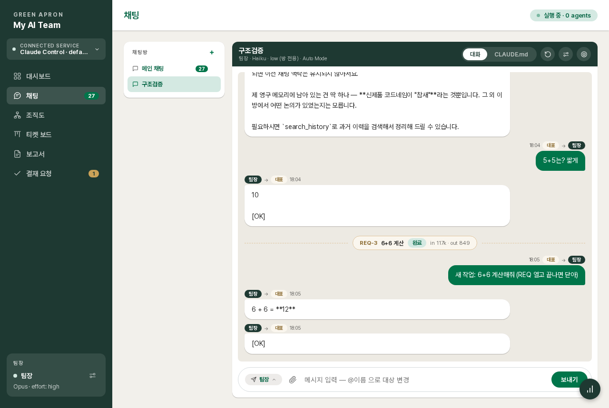
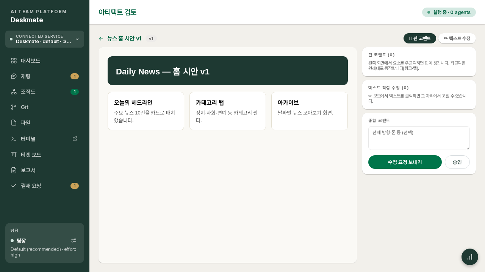
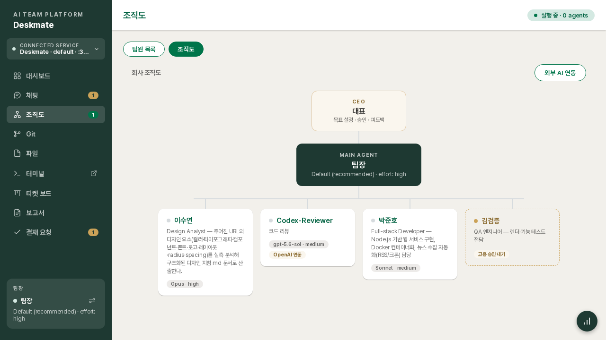
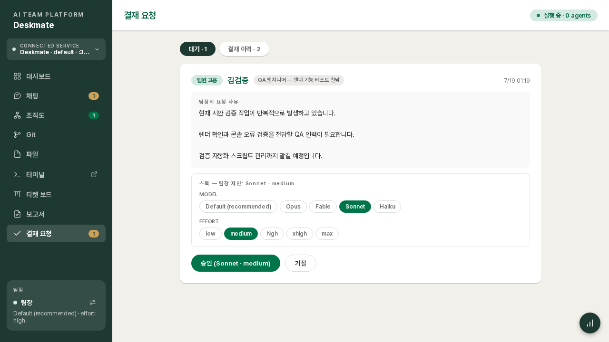

**한국어** · [English](README.en.md)

# Deskmate

**Claude Code를 하나의 회사처럼 운영하는 웹 플랫폼.**
대표(당신) → 팀장(메인 에이전트) → 팀원(서브 에이전트) 구조입니다. 채팅으로 지시하면 팀장이 요청을 분석해 팀원에게 위임하고, 결과는 검증을 거쳐 보고서와 산출물로 돌아옵니다.

> A web platform that runs Claude Code as a company-like AI team — you are the CEO, a Team Lead agent plans & verifies, Worker agents implement.


## 요구사항

| 항목 | 내용 |
|---|---|
| **Node.js** | ≥ 22.5 (내장 SQLite 사용 — 낮으면 안내 후 종료) |
| **Claude Code** | 서버에 **설치 + 로그인 완료**(`claude /login` 또는 `claude setup-token` 토큰) 필수 — 없으면 UI 미리보기(mock)만 동작 |
| **Claude 요금제** | Pro/Max 구독(권장) 또는 Anthropic API 키 |
| 선택 | `git`(Git 메뉴), `codex` CLI(외부 AI 팀원), `tmux`(터미널 세션 영속) |

### Claude 인증 — macOS / Linux 차이

에이전트 구동엔 Claude Code 인증이 필요합니다. OS에 따라 권장 방식이 다릅니다.

| | Linux | macOS |
|---|---|---|
| 자격증명 저장 위치 | `~/.claude/.credentials.json` 파일 | **키체인**(Keychain) 기본 |
| 일반 실행 (터미널에서 직접) | `claude /login` 후 `--driver sdk`로 충분 | 동일 — 로그인만으로 동작 |
| 데몬/서비스 운영 (systemd·launchd) | 로그인만으로 동작 | ⚠ 키체인이 로그인 전엔 잠겨 있어 **인증이 끊길 수 있음** — `claude setup-token`으로 장기 토큰 발급 후 `CLAUDE_CODE_OAUTH_TOKEN` 환경변수 주입 권장 |
| 사용량 위젯 | 항상 동작 (파일 기반) | `.credentials.json` 파일이 있을 때 동작 — 키체인에만 저장된 환경이면 위젯만 비활성 (다른 기능은 정상) |

주의 2가지:

- **`--driver sdk`를 명시하세요.** 미지정 시 자동 감지는 환경변수(`ANTHROPIC_API_KEY`/`CLAUDE_CODE_OAUTH_TOKEN`)만 확인해서, 로그인만 되어 있는 환경에선 mock(미리보기)으로 시작합니다.
- 장기 토큰(`setup-token`)은 Pro/Max **구독 과금**으로 1년 유효하며, 모델 호출 전용입니다 (Remote Control 불가). API 키(`ANTHROPIC_API_KEY`)는 구독과 별개인 **종량 과금**이니 요금제를 확인하세요.

macOS 헤드리스 운영 시 추가 팁: 자동 로그인 활성화(키체인 해제), FileVault 비활성(무인 부팅), `pmset -a sleep 0 autorestart 1`(절전 금지·정전 복구), 프로젝트가 외장 볼륨이면 기동 스크립트에 마운트 대기 로직을 넣으세요.

> **보안 권고** — 대시보드 접근 = 서버 명령 실행 권한입니다. **인터넷에 직접 노출하지 말고, 내부망 또는 VPN(Tailscale/WireGuard 등) 안에서만 사용하세요.** 외부 접근이 꼭 필요하면 아래 보안 섹션의 로그인 + `--allow` + HTTPS를 반드시 조합하세요.

## 이 플랫폼의 용도

터미널에서 Claude Code를 1:1로 사용하는 대신, **여러 에이전트를 하나의 조직처럼 운영**하고 싶을 때 사용합니다.

- 개발·문서·디자인 작업을 **역할별 AI 팀원**에게 분담시키고, 팀장이 브리프 작성과 결과 검증을 담당합니다
- 진행 상황은 **티켓 보드·요청(REQ)·보고서**로 추적하고, 중요한 결정은 **결재**로 승인합니다
- 웹 산출물은 화면 위에 **핀을 꽂아 리뷰**하면, 수정 지시가 구조화된 문서로 팀에 전달됩니다
- 브라우저만 있으면 어디서든(모바일 포함) AI 팀에 지시하고 서버의 파일·터미널·Git까지 관리할 수 있습니다

요컨대, **Claude Code 위에 작은 회사를 세우는 도구**입니다.

## ⚠ 보안 — 반드시 읽어주세요

**이 대시보드에 접근할 수 있는 사람은 곧 서버에서 명령을 실행할 수 있는 사람입니다.**
에이전트·웹 터미널·파일 편집이 모두 서버 셸 권한으로 동작하기 때문에, 접근 제어 없이 외부에 노출하면 서버 전체가 장악될 수 있습니다. 아래 보호 장치를 반드시 조합해 사용하세요.

| 장치 | 사용법 | 설명 |
|---|---|---|
| **로그인** | 설정 → 로그인 on | 단일 비밀번호(scrypt 해시 저장). 실패 5회 = 15분 잠금 + 전역 시도 제한. API·파일·WebSocket·터미널 전부 보호. **공개망 배포 시 필수** |
| **비밀번호 분실 복구** | `touch <데이터폴더>/reset-password` | 데이터 폴더 경로는 설정 화면·기동 배너에 표시(기본 `~/.claude-control/<name>`). 서버 셸 접근 = 소유자 증명 |
| **IP 방화벽** | `--allow 192.168.0.0/16,127.0.0.1/32` | 지정 대역 밖 요청은 전부 403. 0.0.0.0 바인딩 시 지정을 강력 권장 |
| **HTTPS** | `--https` | 자체 서명 인증서 자동 생성. 클립보드 등 브라우저 보안 기능 활성화 |
| **HTTP 병행** | `--http-port <n\|off>` | `--https`일 때 HTTP도 함께 리슨 (기본: HTTPS포트+1, `off`=HTTPS만). **모바일 앱 전용** — 앱 식별 헤더 없는 요청(브라우저 등)은 403 |
| **기능 차단** | 설정 → 메뉴 표시 | **터미널·파일·Git은 첫 배포 시 전부 off**가 기본 — 필요할 때만 켜세요. 끄면 메뉴만이 아니라 API까지 차단됩니다 |

추가로: 워크스페이스 파일 API는 경로 탈출(`../`)이 차단되어 지정 폴더 밖을 읽고 쓸 수 없고, 팀원 고용 같은 구조 변경은 대표 결재 없이는 서버가 거부합니다(프롬프트가 아니라 서버 로직 레벨 강제). 인터넷에 직접 노출해야 한다면 TLS 리버스 프록시 + 로그인 + `--allow` 3중으로 두는 것을 권장합니다.

## 토큰은 더 들까, 절약될까?

솔직히 말해 **오케스트레이션 자체는 토큰을 더 소모합니다.** 대신 소모를 줄일 수 있는 장치를 함께 제공합니다.

**더 쓰는 부분**
- 팀장의 판단 턴 — 요청 분류·브리프 작성·결과 검증이 각각 별도의 LLM 턴입니다 (1:1 대화에는 없는 오버헤드)
- 방·팀원별 독립 세션 — 각자 컨텍스트를 유지하므로 세션 수에 비례한 비용이 발생합니다
- 커밋 메시지 자동 생성(선택) — 메시지를 비워두고 커밋할 때만 Haiku를 1회 호출합니다 (미미한 수준)

**절약하는 장치**
- **방별 모델·effort 지정** — 가벼운 방은 Haiku/low로, 중요한 방만 고성능 모델로
- **팀원별 모델 차등** — 반복 작업 팀원은 Haiku로, 설계 팀원만 Opus 계열로 고용 (결재 화면에서 조정 가능)
- **기억 초기화**(전체/방별) — 세션이 비대해져 매 턴의 컨텍스트가 커질 때 리셋 (데이터 유지 옵션 제공)
- **외부 AI 팀원(Codex)** — 리뷰 등 일부 작업을 OpenAI 쪽으로 오프로드해 Claude 사용량 분산
- **REQ별 토큰 집계 + 실시간 사용량 위젯** — 어디에 얼마가 쓰였는지 항상 보이므로 낭비 지점을 바로 찾을 수 있습니다
- 긴 보고는 요약과 원문 팝업으로 분리되고 티켓은 위임 시 자동 생성 — 형식을 채우는 데 쓰이는 턴을 최소화합니다

## 내장된 방법론

- **Karpathy 코딩 가이드라인 내장** — 모든 에이전트의 불변 지침에 Andrej Karpathy의 LLM 코딩 원칙이 기본 적용됩니다: *코딩 전에 생각하라(추측 금지) · 단순함 먼저(과설계 금지) · 외과적 변경(요청된 것만) · 목표 기반 실행(검증될 때까지)*.
- **Advisor 전략** — 팀장은 "조언자" 포지션으로 고정됩니다: 판단·브리프·검증만 수행하고 구현 노동은 팀원에게 위임(파일 편집 툴이 서버 차원에서 차단). 비싼 모델은 판단에, 저렴한 모델은 노동에 쓰는 비용 구조를 플랫폼이 강제합니다.

## 핵심 개념

### 대표 – 팀장 – 팀원

- **대표(당신)** — 목표 설정·지시·결재·산출물 검토를 맡는 유일한 사람입니다.
- **팀장(메인 에이전트)** — 요청 분석 → 작업 분해 → 위임 → 검증 → 보고를 담당합니다. **파일 편집 도구가 서버 차원에서 차단**되어 있어 직접 구현할 수 없고, 반드시 팀원에게 위임합니다.
- **팀원(서브 에이전트)** — 브리프를 받아 구현·검증하고 팀장에게 보고합니다. 각자 독립된 세션·역할·커스텀 지침을 가집니다.

### 팀원이 생기는 규칙 (3가지 경로뿐)

1. **팀장 제안 → 대표 결재**: 팀장이 필요를 판단해 사유·역할·**적정 모델/effort 제안**과 함께 결재를 올리고, 대표가 승인 화면에서 스펙을 조정해 승인하면 입사합니다.
2. **대표 직접 고용**: 조직도에서 이름·역할·모델·커스텀 지침을 지정해 즉시 고용 (대표가 곧 결재권자).
3. **외부 AI 연동**: OpenAI Codex를 팀원으로 편입 — 팀장의 지휘를 받는 건 동일합니다.

이 세 가지 외의 경로(에이전트가 임의로 서브에이전트를 만드는 것 등)는 서버가 차단하며, 해고 역시 결재를 거칩니다.

### 채팅방 — 방마다 독립된 두뇌

- 방을 만들면 팀장의 **세션(기억)이 방 단위로 분리**됩니다. 주제가 섞이지 않고, 한 방을 초기화해도 다른 방에는 영향이 없습니다.
- 다른 방의 결정이 필요하면 팀장이 **전체 이력 검색** 도구로 찾아 참조합니다.
- **방마다 모델·effort를 따로 지정**할 수 있습니다 (채팅 ⚙ → 이 방의 MODEL·EFFORT). 미지정 시 팀장 기본 스펙.
- 대화 초기화는 두 가지: **전체 초기화**(내용+기억) / **내용만 지우기**(화면 정리, 기억·진행 작업 유지).

## 기능 소개

### 멀티 서버 연결
프로젝트마다 `--name`으로 인스턴스를 띄우고, 사이드바 상단 **서비스 스위처**에 여러 서버(다른 포트·다른 머신)를 등록해 한 브라우저에서 오가며 운영합니다.

### 채팅
전 구성원과 한 화면에서 소통(@이름 지목·수신 대상 선택), 위임 과정 실시간 표시, 발신자 아바타(클릭 시 해당 팀원 설정 팝업), 파일·이미지 첨부(드래그/붙여넣기), **긴 텍스트 붙여넣기는 칩으로 요약**(원문 팝업), Shift+Enter 개행, 선택·폼·diff 승인·산출물 검토 **인터랙티브 카드**, Plan Mode의 **계획 승인 카드**(전문 팝업), 대화 **Markdown 내보내기**, 안읽음 배지.

### 팀원별 모델 설정
조직도(또는 채팅 아바타 클릭) → 설정 팝업에서 팀원마다 **이름·아바타·역할·커스텀 지침·모델·effort**를 개별 지정합니다. 고용 결재 시점에도 팀장의 제안 스펙을 조정해 승인할 수 있습니다. 방 단위 오버라이드와 조합하면 "이 방에서만 Opus, 평소엔 Sonnet" 같은 운용이 됩니다.

### 사용량 모니터링
우하단 위젯(모바일은 하단 탭)에서 **Claude 구독 사용량**(세션·주간 한도, 리셋 시각)과 오늘의 토큰 in/out을 실시간 확인. 요청(REQ)마다 소요 토큰이 집계되어 어떤 일에 얼마가 들었는지 추적됩니다.

### 파일
워크스페이스 한정 파일 탐색기 + CodeMirror 에디터(문법 하이라이트, ⌘S 저장). 트리에서 **DnD 이동·외부 파일 업로드·다운로드**, 다중 선택(Ctrl/Shift/드래그 범위)과 **⌘C/⌘X/⌘V/Del 단축키**, 우클릭 메뉴, 클립보드 파일 붙여넣기 업로드. 모바일은 에디터 중심 + 파일트리 팝업.

### 터미널
서버 셸에 웹으로 직접 접속. 화면 분할(가로/세로)·창별 폰트 크기·헤더 DnD 배치·복사/붙여넣기·스크롤백·새 창 팝업. 세션은 서버 프로세스가 살아있는 동안 유지되고, 연결이 끊긴 세션은 30분 뒤 자동 정리됩니다. **기본 off** — 설정에서 켜야 동작합니다.

### Git
커밋 그래프·브랜치·커밋별 diff·파일 트리(접기/펼치기)에 더해, **워킹트리 스테이징 → 커밋을 대시보드에서 직접**: 파일별 스테이지/내리기, diff 미리보기, `.gitignore` 편집(저장 즉시 목록 반영), 커밋 메시지 **비워두면 변경 내용 분석해 자동 생성**(Haiku 1회, 실패 시 규칙 기반 폴백 — 토큰 0).

### 업무 추적 — 티켓·요청·보고서·결재
위임할 때마다 **티켓이 자동 생성**되고 팀원 응답 시 검토, 요청 완료 시 done으로 자동 전이됩니다(수동 조정도 가능). 대표의 요청은 REQ로 분류되어 대화·토큰·보고서가 묶이고, 완료 시 **산출 보고서**(웹 열람 + PPTX/Excel 다운로드)가 등록됩니다. 방향 결정·위험 작업은 **결재함**으로 올라옵니다.

### 산출물 핀 리뷰
웹 결과물 위에서 **우클릭으로 핀**을 꽂아 코멘트하고(좌클릭은 링크 등 원래 동작), 텍스트는 그 자리에서 직접 수정. 제출하면 요소 셀렉터·수정 전/후가 담긴 **구조화된 지시서**가 팀에 전달되고, 반영본이 다시 검토로 돌아오는 버전 루프. 넓은 시안은 화면 폭에 맞게 자동 축소됩니다.

### 그 외
- **예약 작업**: 매일/매주/1회 지정 시각에 팀장·팀원에게 자동 지시
- **다국어**: 한국어/English — UI만이 아니라 **에이전트의 응답 언어까지** 전환 (번역 직무 팀원은 예외 허용)
- **실행 모드**: Plan(계획 승인 후 실행) / Auto(파일 수정 자동 수락) / Ask
- **모바일 최적화**: 하단 탭(스와이프 확장), 페이지 헤더 없는 전체 화면 레이아웃

## 빠른 시작

요구사항: **Node.js ≥ 22.5** (낮으면 안내 후 종료), Claude Pro/Max 구독(권장) 또는 Anthropic API 키.
선택 의존성: `git`(Git 메뉴 — 없으면 해당 메뉴만 비활성), `codex` CLI(외부 AI 팀원).

```bash
# GitHub에서 바로 실행 (설치 즉시 기동 — 빌드 불필요)
npx github:asete93/deskmate

# 주요 옵션
npx github:asete93/deskmate \
  --port auto \                     # 남는 포트 자동 할당 (기동 배너에 실제 주소 표시)
  --name myproject \                # 데이터 공간 분리 (~/.claude-control/myproject)
  --allow 192.168.0.0/16 \          # 접근 허용 IP 대역 (미지정 시 전체 허용)
  --https \                         # 자체 서명 인증서로 HTTPS 기동 (클립보드 등 secure 기능)
  --http-port 3201 \                # HTTPS와 HTTP 동시 리슨 (기본: HTTPS포트+1, off=끄기)
  --lang en \                       # 기동 시 시스템 언어 (UI + 에이전트 응답 언어, ko|en)
  --no-terminal --no-files \        # 터미널·파일 기능 완전 비활성 (설정에도 미노출, API 차단)
  --driver sdk                      # mock | sdk | auto
```

인증(실 Claude 구동) — 셋 중 하나:

```bash
# 1) 권장: Claude 구독 장기 토큰
claude setup-token   # 발급 후
CLAUDE_CODE_OAUTH_TOKEN=<토큰> npx github:asete93/deskmate

# 2) 이미 `claude /login` 된 머신이면 그대로 실행 (자동 감지 → sdk 승격)

# 3) API 키
ANTHROPIC_API_KEY=sk-ant-... npx github:asete93/deskmate
```

기동하면 배너에 접속 주소가 출력됩니다:

```
┌──────────────────────────────────────────────────
│  Deskmate · myproject
│  ▶ http://localhost:34357  (bind 0.0.0.0:34357)
└──────────────────────────────────────────────────
```

인증 없이 실행하면 **mock 드라이버**(전 플로우 시뮬레이션)로 떠서 UI를 미리 볼 수 있습니다.

업데이트: 새 커밋 반영이 안 되면 `rm -rf ~/.npm/_npx` 후 재실행하거나, `npm i -g github:asete93/deskmate`로 전역 설치 후 같은 명령으로 재설치하세요. 데이터는 패키지 밖(`~/.claude-control/`)이라 업데이트에 안전합니다.

## 화면

| | |
|---|---|
|  |  |
| 채팅방 — 위임 과정·REQ 경계·토큰이 한 흐름에 | 주석 리뷰 — 결과물에 핀을 꽂고 텍스트를 직접 수정 |
|  |  |
| 회사 조직도 | 결재 — 팀장이 올린 안건을 스펙 조정 후 승인 |

전체 기능 설명은 **[사용자 가이드](docs/USER_GUIDE.md)** ([English](docs/USER_GUIDE.en.md))를 참고하세요.

## 데이터와 영속성

- 모든 데이터(대화·방·설정·보고서·워크스페이스·업로드)는 **데이터 폴더**에 저장됩니다 — 기본값은 `~/.claude-control/<name>/`(`--name` 기준)이고, `--data <경로>`로 지정하면 그 경로입니다. 실제 경로는 기동 배너와 설정 화면(비밀번호 분실 안내)에 표시됩니다. **서버를 재기동해도, npx를 새로 받아도 유지**됩니다.
- 에이전트의 대화 기억은 방별 세션으로 저장되어 재기동 후 이어집니다. 세션 파일이 유실되면 자동으로 새 세션으로 복구되고 채팅 이력은 DB에 남습니다.
- 상시 운영은 systemd 등록을 권장합니다(부팅 자동시작 + 크래시 복구) — [사용자 가이드의 배포 절](docs/USER_GUIDE.md#12-배포) 참고.

## 아키텍처

```
server/   Node 22.5+ · Express · ws · node:sqlite (네이티브 모듈 0)
web/      Preact · esbuild 번들 (dist 커밋 — 설치 시 빌드 불필요)
데이터     ~/.claude-control/<name>/  (control.db · workspace/ · uploads/)
```

앱 SQLite가 단일 진실 소스(세션이 죽어도 상태 유지), 드라이버 추상화(mock/sdk), 4계층 지침 구조(서버 로직 → 불변 플랫폼 지침 → 프로젝트 CLAUDE.md → 런타임 설정). 자세한 설계는 [ARCHITECTURE.md](ARCHITECTURE.md).
